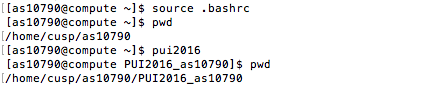
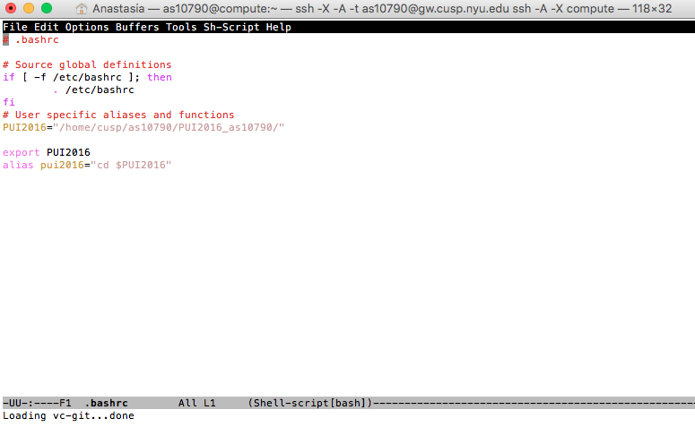

# PUI2016_as10790

To complete Homework #1, assignment 1 (completing the lab and setting up github), I largely followed Federica's instructions in githubCreateRepoCmds.md. I also attended Federica's office hours and worked with classmate Adrian to fork, clone, and make changes to his repo. I had no major problems with this portion of the homework.

For the assignment 2 I received some help from classmate Avikal on how to create an environmental variable. I figured out on my own how to make and save changes using emacs editor, including how to create an alias. I had some difficulties linking the remote and local repositories. To resolve them, I attended Sabreen's office hours. I also received help from my classmate Avikal with inserting screenshots in my README file.

